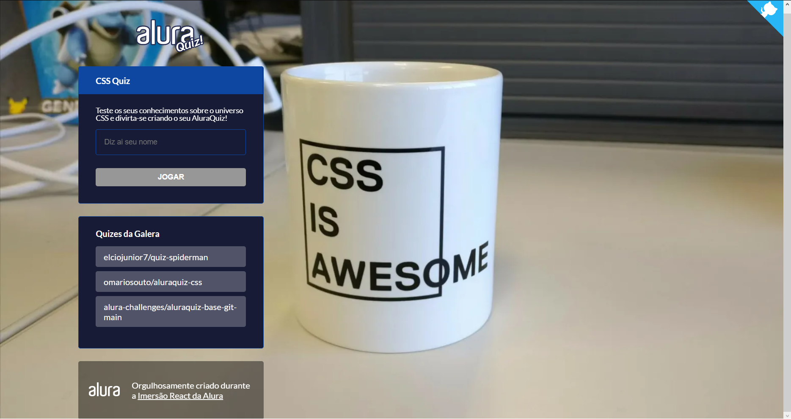

# Alura-Quiz - Imersão React

## Dependencies
* Next.js
https://nextjs.org/

* Styled Components
**Official Site** 
https://styled-components.com/

**Install the styled-components using the repository example** 
https://github.com/vercel/next.js/tree/canary/examples/with-styled-components

**Github from Styled Components**
https://github.com/styled-components/styled-components

**Material UI to help to choose the primary and secundary colors**
https://material-ui.com/pt/getting-started/installation/

**Help colors**
https://material-ui.com/pt/customization/color/

**About the SASS used in the code**
https://sass-lang.com/documentation/style-rules/parent-selector
